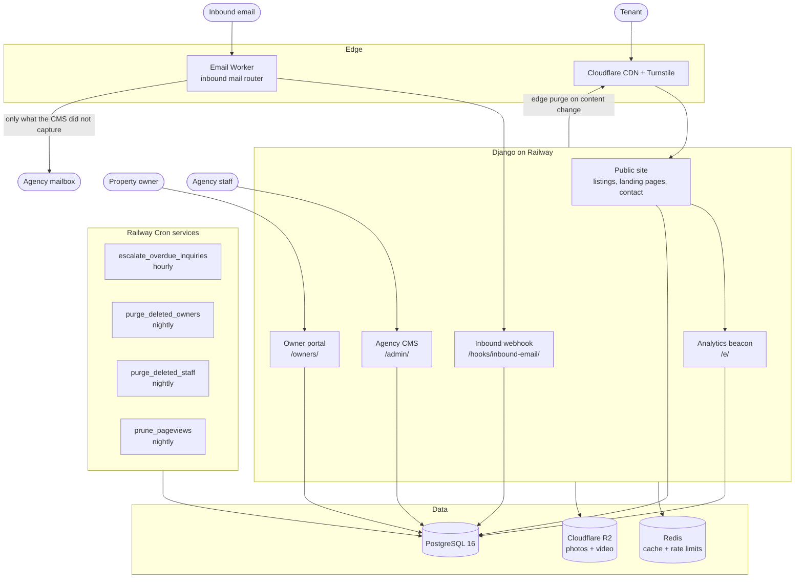
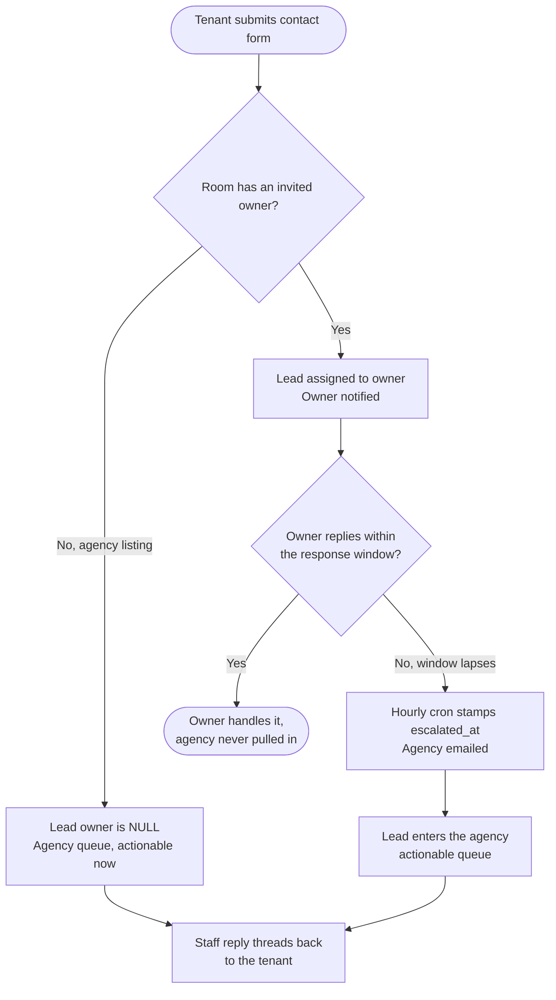
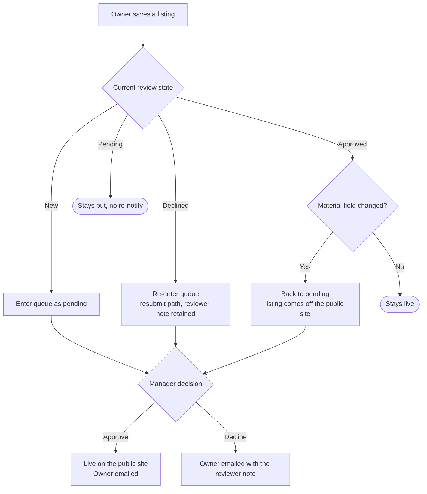

# Rooms OKC — Room Rental Marketplace Platform

> **A production room-rental marketplace for Oklahoma City — a public listings site, a bespoke CMS for agency staff, and a self-service portal for property owners, wired together by an inbound-email pipeline that turns every tenant reply into a threaded conversation on the right lead, a listing review queue that vets owner submissions before the public sees them, and a cookieless first-party analytics stack that needs no consent banner.**

---

## Overview

Most "rental site" builds stop at a searchable grid of rooms and a contact form. The hard part is everything that happens after a tenant clicks send: who owns that lead, who is allowed to answer it, what happens when nobody does, how the tenant's email reply gets back onto the right thread, and how an outside landlord posts a listing without being able to publish anything they like.

This platform is built around those questions. It serves three distinct audiences from one Django codebase:

| Surface | Who uses it | What it does |
|---------|-------------|--------------|
| **Public site** | Tenants | Browse and filter available rooms, view listing detail pages with photo galleries, video, and an embedded map, submit an enquiry |
| **Agency CMS** (`/admin/`) | Agency staff and managers | Room CRUD with media upload, lead inbox with reply threading, owner oversight, listing review queue, team management, traffic analytics, site settings |
| **Owner portal** (`/owners/`) | Invited property owners | Post and edit their own listings (subject to review), answer leads on their own rooms, manage their account |
| **Django admin** (`/dev-admin/`) | Superusers | Power-user back-office over every model, fully themed with django-unfold — no page uses the stock Django look |

A separate **Cloudflare Email Worker** sits in front of the domain's mail routing and hands inbound messages to the app, which is what makes tenant replies land back on their lead instead of in a shared mailbox.

**Scale of the build:** ~11,300 lines of application Python across six Django apps, **849 tests** in a pytest suite, and CI that runs Ruff lint + format checks and the full suite against real Postgres and Redis services on every push and pull request.

---

## System Architecture

---

## Lead Ownership and Escalation

The single most consequential design decision in the platform: **a lead belongs to exactly one party at a time, and read access is not the same as write access.**

Two querysets encode the rule:

- **`visible_to(user)` — read scope.** Staff see everything, including every owner's leads, because oversight is part of running the agency. An owner sees only leads on their own rooms.
- **`editable_by(user)` — write scope.** An owner owns their leads outright. Staff own the agency queue (`owner IS NULL`) **plus** any owner lead that has escalated. Before escalation, a manager's view of an owner's lead is oversight only — read-only — so the owner keeps control while their window is open.

Escalation is the *only* path that hands an owner's lead to the agency. There is no silent CC. The response window is configurable per agency (`owner_response_sla_hours`, default 24), and the `escalate_overdue_inquiries` command is idempotent — an already-escalated lead is skipped, so overlapping or missed cron runs are safe.

The inbox also separates **unread** from **status**: `new` means unanswered, unread means unseen. Leads sort into two tiers — everything unread first, newest first within each tier — because straight recency buries a lead you have not seen under ones you have.

---

## Inbound Email Pipeline

Tenants reply to notification emails from their own mail client. Without an inbound path, those replies land in a shared Gmail inbox with no connection to the lead record, and the conversation history in the CMS is permanently half a conversation.

A **dependency-free Cloudflare Email Worker** receives the mail and POSTs it to the app's webhook. The app parses the raw MIME with Python's standard library — the Worker does no parsing at all, which is why it deploys straight from the Cloudflare dashboard with no npm and no build step.

**Reply addressing:** notifications go out with a `reply+<reference>@` Reply-To. Those addresses have no specific routing rule, so they fall through the catch-all to the Worker.

**Two message classes open or extend a lead:**

| Message | Result |
|---------|--------|
| Reply to `reply+<reference>@` | Threads onto the existing lead's conversation and flips it back to **New** |
| Cold mail to a published mailbox (`INBOUND_LEAD_ADDRESSES`) | Opens a new agency lead, subject line at the top of the message |
| Anything else the catch-all grabs | Acknowledged and ignored — never becomes an inbox row |

**Selective forwarding.** Because `info@` is routed to the Worker rather than straight to Gmail, the Worker also performs the Gmail delivery the routing rule used to do — but only for mail the CMS did *not* capture. The app decides per message and signals it back via an `X-Inbound-Forward` response header:

| Message | Forwarded to Gmail? | Why |
|---------|--------------------|-----|
| Opens a new lead | No | The CMS sends its own branded notification |
| Threads onto a lead | No | Same |
| Our own notification | **Yes** | This is how the branded mail reaches the mailbox |
| Automated notice, invoice, verification code | **Yes** | Not a lead, but a person must read it |
| Sender over the rate limit | **Yes** | Never silently lose a real person |
| Reply to a lead that no longer exists | **Yes** | Nobody would see it otherwise |
| Catch-all junk | No | Or the mailbox becomes the domain's spam trap |

The rule that matters: **anything the CMS records is not forwarded.** Doing both is what put two emails in the mailbox for every enquiry — the raw email and the branded notification.

**The reply-all edge case.** A tenant replying to all on a notification addresses the message to both `reply+<reference>@` and `info@`. Cloudflare runs the Worker **twice**, once per recipient, and each invocation's `message.to` names only its own address. Left alone, the `info@` copy reads as cold mail and opens a *second* lead — whose notification goes to `info@` and puts the sender's own reply back in their inbox. Two mitigations run together:

1. The app looks for the reply reference in the message's own `To`/`Cc` headers, not just the envelope recipient, so both copies resolve to the same lead.
2. Messages are deduplicated on `Message-ID`, so only the first copy is recorded.

`INBOUND_LEAD_ADDRESSES` and the Cloudflare routing rules are deliberately independent: adding a mailbox to the setting without a routing rule does nothing, and pointing the catch-all at the Worker without adding to the setting is safe. Catch-all junk can never become inbox rows.

---

## Listing Review Workflow

Every owner listing is vetted before the public sees it. Agency rooms are not — a manager posting a room *is* the review — so the only thing that ever enters the queue is a listing an outside owner submitted or changed.

**Material fields** — address, room type, price, location, description, plus photo/video changes — send an approved listing back through review, because they change the thing that was approved. Ticking an amenity, fixing a map link, or marking a room rented leaves it live.

A listing already pending stays where it is in the queue however many times its owner saves it. The reviewer reads the room as it stands now, and re-notifying on every keystroke trains reviewers to ignore the mail.

One detail worth calling out: the owner-facing sentence describing *what* triggers re-review is **generated from the same frozen set the workflow branches on**, with an assertion tying the two together. The one place this was ever hand-written — a banner on the room form — had already drifted from the code, promising re-review on photo changes while never mentioning video. Now a new material field cannot silently go unmentioned.

---

## Contact-Form Spam Defence

Three independent layers, each cheap enough to run inline on a form POST.

**1. Honeypot.** Catches bots that fill every field they find. Does nothing against bots that fill only the *visible* fields.

**2. Heuristic scoring** (`inquiries/spam.py`). Weighted signals — URLs in the message or name field, BBCode/anchor markup, pitch vocabulary (`seo`, `backlink`, `crypto`, `casino`, …), non-Latin script share, an alias writing in under a second email address within 24 hours — sum against a threshold. Design constraints:

- **Scoring, not a verdict.** No single signal condemns a submission. A tenant writing in Spanish trips one signal, not four.
- **Quarantine, not deletion.** A flagged lead is still saved — it lands in the inbox's Spam tab with its reasons attached, so a false positive is one click from recovery. What flagging *does* suppress is the outbound mail: no owner notification, and crucially **no auto-reply to the sender**, so the form cannot be used as a free relay to an address the spammer chose.
- **Dependency-free.** No language-detection model, no network call.

**3. Cloudflare Turnstile** — a no-puzzle CAPTCHA on the form, inert until keys are configured. With `TURNSTILE_SITE_KEY` and `TURNSTILE_SECRET_KEY` unset (dev, tests, and prod until they are pasted in) the widget does not render and verification passes everything through. Setting both switches it on with no code change.

Plus an IP rate limit of 5 submissions per hour. The inquiry row is **always** saved; a failing notification email is logged, never fatal.

---

## First-Party Analytics — No Cookie, No Consent Banner

Traffic is measured in-house. No Google Analytics tag, no third party, no cookie-consent banner.

**Why a beacon rather than server-side counting:** the public pages are cached at the Cloudflare edge, so most visits never reach Django. A POST is never served from cache, so the beacon counts them all.

**What is stored:** the path, the referring site's *host* only (never the full URL — a full URL can carry search terms in its query string), a desktop/mobile/tablet guess, and a `visitor_hash`. **No IP address, no cookie, no advertising identifier.**

The visitor hash is a digest of IP and user-agent salted with **the current date** and the secret key. It cannot be reversed to an IP, and because the salt rotates at midnight, the same person is a different hash tomorrow. That is enough to count *how many people*, and deliberately not enough to follow one of them around.

**Every stored path is provably real.** The collection endpoint must be CSRF-exempt — a CDN-cached page cannot carry a fresh CSRF token — so the path in the payload is attacker-controlled. The classifier resolves it against a whitelist of tracked public views *and* verifies the underlying record exists before writing a row. Without that gate, anyone could write arbitrary strings into the "Top Pages" table a manager reads.

**Query design.** Both table indexes lead with `created_at`, because every query the table serves is "within a date window, then group by something" — Postgres satisfies the unique-visitor count from the first index alone. The `in_range` queryset is half-open on purpose, so consecutive windows tile exactly and a view can never be counted in both a period and the period before it, which is what the "vs. previous period" comparison depends on.

**No rollup table.** At this site's volume a year of raw rows is small, and keeping raw rows means every breakdown (pages, rooms, sources, devices) stays available for the whole retention window instead of only the totals someone thought to pre-aggregate. A nightly `prune_pageviews` cron enforces `ANALYTICS_RETENTION_DAYS` (default 365) — and the deployment docs are explicit that if the cron never runs, nothing is ever deleted and the site keeps data longer than the analytics page tells managers it does.

`PageView.room` is `SET_NULL` rather than `CASCADE`: deleting a listing should not retroactively rewrite last month's traffic total. The row keeps its path and still counts under Top Pages.

---

## Caching and Edge Delivery

**Grid caching by version stamp.** The room grid is cached per filter-combination. Rather than tracking and deleting every possible key when a room changes, keys are stamped with a monotonic `rooms:version` that gets bumped on any room or photo change — so all cached grids fall out of use at once, cheaply.

**Taxonomy caching.** Room types, rate periods, amenities, and budget ranges are all editable in the CMS and read on every hot public page. Each is cached as a plain list of dicts and invalidated by a `post_save`/`post_delete` signal.

**A cache policy that is safe by construction.** `CacheControlMiddleware` is registered outermost, so on the way out it sees the *final* response — including any `Set-Cookie` added by the session, CSRF, or messages middleware — and automatically downgrades those to `private`. The CMS, Django admin, owner portal, and contact form are additionally hard-listed as never-cacheable prefixes. A response can only become publicly cacheable if nothing in the stack made it user-specific.

**Instant edits.** Content changes fire a Cloudflare edge purge, so a manager's edit appears immediately rather than after a TTL.

---

## Media Pipeline

**Photos** (max 7 per room, 10 MB each, JPEG/PNG/WebP):

1. Validate format and size server-side — extension and content-type are not trusted; the file is opened with Pillow.
2. Apply EXIF orientation, then **drop all EXIF** — including GPS coordinates from a phone camera.
3. Downscale to 1600px wide with LANCZOS resampling.
4. Re-encode as optimised JPEG at quality 80, renamed to a UUID.

The first photo is the cover. Files are deleted from disk/object storage automatically via django-cleanup.

**Video** (max 3 per room, 50 MB each, MP4/WebM/MOV/M4V): uploads are re-encoded to H.264/AAC MP4 with `+faststart` — so playback can begin before the whole file downloads — at a capped width. Transcoding is CPU-heavy, so it runs on a background thread after the upload request has committed: the `RoomVideo` row exists immediately with `processing` status and flips to `ready` or `failed` when FFmpeg finishes. The whole path is toggleable via `VIDEO_TRANSCODE`, and the test suite disables it by default.

Media is stored on **Cloudflare R2** in production (S3-protocol client pointed at R2's endpoint), with a filesystem fallback for local and VPS deploys.

---

## Account Lifecycle — Deletion With a Grace Period

Closing an account is a two-step process rather than a button that erases things.

**Step 1 — schedule.** An owner closes their account from *My Account → Delete Account*, or a manager does it from the owner's page. This stamps `deletion_requested_at`, which **takes their listings off the public site immediately** but destroys nothing. The account stays fully usable for `OWNER_DELETION_GRACE_DAYS` (default 30), so either side can cancel and get everything back exactly as it was.

**Step 2 — purge.** A nightly `purge_deleted_owners` cron erases accounts whose grace period has lapsed: the profile, the login, their rooms, and the photo and video files behind them.

**Tenant enquiries are kept** as agency records — `Inquiry.owner` goes NULL rather than cascading — so lead history survives the landlord leaving. Site-manager accounts work identically via `purge_deleted_staff`. Both commands support `--dry-run`.

Onboarding mirrors this: the site is invite-only, so owners arrive through an `OwnerInvite` already approved. The `PENDING`/`SUSPENDED` states remain for accounts a manager wants to hold back or shut off, and staff onboard through a parallel `StaffInvite` flow with emailed setup links.

---

## SEO Layer

- **Structured data.** Every JSON-LD emission goes through a single `json_ld()` helper so the escaping rule lives in exactly one place — `<`, `>`, and `&` are unicode-escaped, so listing-supplied text containing `</script>` cannot break out of the script element it is embedded in.
- **A deliberate omission.** The sitewide `RealEstateAgent` node carries **no** `telephone` or `email`. The site never prints either in a harvestable form — a phone number reaches the page only as a base64 payload the Call Now button decodes on tap — and putting them in JSON-LD would undo that on every page. Contact details live on the Google Business Profile instead, which is where local search reads them from anyway.
- **Landing pages.** Editable room-type and budget-range taxonomies each own a landing page with its own intro copy, giving search engines real destination pages for "weekly rooms in OKC" style queries rather than one filtered grid behind query parameters.
- **Image sitemap.** The room sitemap attaches each listing's photos via the image sitemap extension, with photos prefetched so a full-catalog sitemap does not cost one extra query per listing.
- Absent addresses are **omitted** from `PostalAddress` rather than sent empty — an empty `streetAddress` is a worse signal to a search engine than an absent one.

---

## Domain Rules

**Pricing.** A room carries an optional `weekly_price` and an optional `monthly_price`, with a database `CheckConstraint` guaranteeing at least one is set — a listing with no rate has nothing to show on a card and sorts as NULL against every other room. Public budget filters and price sorting compare a *monthly equivalent* computed from the rate period's multiplier, while cards and detail pages always show the native rate.

**Room status.** `available` (public), `hidden` (staff only), `rented` (staff only, shown as off-market in the CMS) — held separately from `review_status`, so a room can be approved but hidden, or pending review but marked rented.

**Location** is free text typed by whoever writes the listing. It was briefly a foreign key on a Location taxonomy so each area could own a landing page; that was reverted deliberately in favour of letting owners name their own neighborhood, and nothing downstream assumes a fixed set of spellings.

**Coordinates** are derived from a pasted Google Maps link where they can be extracted, and drive the embedded map. Without a `GOOGLE_MAPS_API_KEY`, detail pages degrade to a plain "View on map" link rather than breaking.

---

## Testing and CI

**849 tests** across 38 modules, using pytest, pytest-django, and factory_boy against a real Postgres instance. Coverage is behavioural rather than line-chasing — the largest suites are the ones guarding the rules that are expensive to get wrong:

| Suite | Tests | What it protects |
|-------|------:|------------------|
| `test_team.py` | 84 | Staff invitations, roles, self-service details, deletion |
| `test_inbound_email.py` | 48 | Reply threading, cold mail, dedup, forward decisions |
| `test_owner_admin.py` | 48 | Manager oversight of owner accounts |
| `test_owner_portal.py` | 47 | Owner-scoped listing and lead access |
| `test_manage_views.py` / `test_manage_inquiries.py` | 39 each | CMS room CRUD and the lead inbox |
| `test_listing_review.py` | 34 | Review state machine and material-change detection |
| `test_spam.py` | 30 | Scoring signals and quarantine behaviour |
| `test_suspension.py` | 27 | Suspended-account access denial |
| `test_lead_routing.py` | 20 | Who receives which notification |
| `test_escalation.py` | — | SLA lapse, escalation stamping, idempotency |

Also covered: caching behaviour, email branding, greeting-name derivation, slug generation, maintenance mode, error pages, SEO output, maps parsing, and a template test asserting no HTML comments render into public output.

**CI** (GitHub Actions) runs on every push to `main` and every pull request: Postgres 16 and Redis 7 service containers with health checks, `ruff check` plus `ruff format --check`, then the full suite on Python 3.12. A committed pre-commit hook (`git config core.hooksPath .githooks`) auto-formats staged Python so the format check stays green.

---

## Deployment

**Production:** Railway (web service + cron services) · PostgreSQL and Redis plugins · Cloudflare R2 for media · Cloudflare CDN in front with edge purge on content change · Resend over the Anymail HTTP API backend (SMTP ports are blocked on most PaaS) · Sentry for unhandled exceptions.

**Also supported:** a self-contained Docker Compose stack (`docker-compose.prod.yml`) with Gunicorn behind Nginx, a shared media volume, `X-Forwarded-Proto` forwarding so Django's HTTPS redirect and HSTS work correctly, and an entrypoint that waits for the DB, migrates, and runs `collectstatic` before booting.

**Four cron services:**

| Command | Schedule | Purpose |
|---------|----------|---------|
| `escalate_overdue_inquiries` | Hourly | Hand lapsed owner leads to the agency |
| `purge_deleted_owners` | Nightly | Erase owner accounts past their grace period |
| `purge_deleted_staff` | Nightly | Same for site-manager accounts |
| `prune_pageviews` | Nightly | Enforce the analytics retention window |

**Backups:** a nightly script writes gzipped `pg_dump` output plus a media tarball, prunes to `RETENTION_DAYS` (default 14), and optionally copies off-site to S3. A matching `restore.sh` exists so restores are tested rather than assumed.

**Email deliverability** is documented as a first-class concern: a transactional provider rather than a raw mailbox, plus SPF, DKIM, and DMARC records on the sending domain.

---

## Key Design Decisions

**Why separate read scope from write scope on leads?**
An agency needs oversight of what its owners are doing — that is the point of being the agency. But if managers can also *reply* to any owner's lead at any time, two people answer the same tenant and the owner stops trusting the platform with their leads. Splitting `visible_to` from `editable_by` lets a manager see everything while only being able to act on what is genuinely theirs. Escalation is the explicit, logged, tenant-invisible transfer of that right.

**Why an email Worker instead of a mailbox integration (IMAP polling, Gmail API)?**
Polling adds latency and a credential to rotate, and it cannot make a *routing* decision — mail has already been delivered by then. Sitting in the routing path means the app decides per message whether the mailbox should even receive a copy, which is what eliminated the duplicate-email problem. The Worker stays dependency-free and does no MIME parsing, so the parsing logic lives in Python where it is unit-tested rather than in JavaScript at the edge where it is not.

**Why quarantine spam instead of rejecting it?**
Rejection at the form means a real tenant who happened to trip the heuristics is silently lost with no way to recover them. Saving the row and hiding it behind a Spam tab makes a false positive a one-click recovery. The important half of "flagged" is not hiding it — it is suppressing the auto-reply, which is what stops the form being used as a relay to an address the spammer chose.

**Why a date-salted visitor hash instead of a cookie?**
A cookie-based tracker requires a consent banner in most jurisdictions, and a banner costs conversions on a site whose entire purpose is a contact form. Salting with the current date gives a truthful unique-visitor count within a day while making cross-day tracking structurally impossible, not merely a policy the operator promises to follow.

**Why validate the analytics path against the URLconf?**
The collection endpoint must be CSRF-exempt for CDN-cached pages to reach it, which makes the payload attacker-controlled. Resolving the path against a whitelist of tracked views and confirming the record exists is the difference between a report a manager can trust and a text field anyone on the internet can write into.

**Why bump a version stamp instead of deleting cache keys?**
The room grid is cached per filter-combination, so the key space is the product of every filter option. Enumerating and deleting all of them on every room save is both slow and easy to get subtly wrong when a new filter is added. A monotonic version prefix invalidates everything at once, in one write, and cannot miss a key.

**Why re-review only on material changes?**
Sending an approved listing back into the queue on any edit means owners stop editing — they leave stale amenities and wrong map links rather than risk their room going dark. Restricting re-review to what the room *is*, where it is, what it costs, and what it looks like keeps the queue meaningful and keeps listings accurate.

**Why generate the owner-facing "what triggers re-review" sentence from the code?**
Because the hand-written version had already drifted — it promised re-review on photo changes and never mentioned video. Deriving the sentence from the same frozen set the workflow branches on, with an assertion tying labels to fields, means the documentation cannot lie about the behaviour.

**Why a grace period on account deletion rather than an immediate erase?**
"Delete my account" is often a moment of frustration, and the listings coming down instantly is what the person actually wants. Separating that from the irreversible erase gives both sides 30 days to reverse a decision, while keeping tenant enquiries as agency records means the agency's lead history does not disappear because a landlord left.

**Why theme the Django admin instead of leaving it stock?**
Two back-offices that look nothing like each other trains staff that one of them is "the real system" and the other is dangerous. Theming `/dev-admin/` in the same brand makes the superuser surface a legible extension of the CMS rather than a foreign tool people avoid.

---

## Possible Extensions

- **Saved searches with email alerts** — a tenant subscribes to a filter combination and gets notified when a matching room is approved.
- **Owner analytics** — scope the existing `PageView.room` breakdowns to an owner's own listings and surface views-per-lead in the owner portal.
- **In-app messaging** — keep the email pipeline as the transport but render the thread as a conversation view for tenants too, via a signed link.
- **Availability calendar** — replace the binary `available`/`rented` status with date ranges, enabling "available from" filtering.
- **Application forms** — promote a lead to a structured tenant application with document upload, moving the platform from enquiry capture to screening.
- **Payments** — deposit and first-month collection via Stripe, tied to the application state.
- **Multi-city** — the OKC constants in the SEO layer and the location free-text field are the two places that assume a single metro; both are already isolated.
- **AI-assisted listing copy** — draft a description from the room's attributes and photos, with the owner editing before submission, routed through the existing review queue.
- **AI lead triage** — score and summarise incoming enquiries in the inbox, extending the existing heuristic spam scorer with semantic intent detection.

---

## Tech Stack

| Tool | Role |
|------|------|
| **Django 5.2** | Application framework — server-rendered templates, ORM, auth, admin |
| **Python 3.12** | Runtime |
| **PostgreSQL 16** | Primary datastore — `ArrayField` for amenities, check constraints, composite indexes |
| **Redis** | Shared cache — room grids, taxonomies, computed analytics reports, rate limit counters |
| **Pillow** | Server-side photo processing — EXIF stripping, downscaling, JPEG re-encoding |
| **FFmpeg** | Background video transcoding to faststart H.264/AAC MP4 |
| **django-unfold** | Django admin theming in the site's brand |
| **django-storages + boto3** | Cloudflare R2 media storage over the S3 protocol |
| **django-anymail + Resend** | Transactional email over HTTP (SMTP ports blocked on PaaS) |
| **WhiteNoise** | Static file serving |
| **Cloudflare** | CDN with edge purge, Turnstile CAPTCHA, Email Routing, R2, Email Worker |
| **Railway** | Application hosting plus four cron services |
| **Docker / Docker Compose** | Local dev database and an alternative Gunicorn + Nginx production stack |
| **Sentry** | Error monitoring |
| **pytest + factory_boy** | 849-test suite against real Postgres |
| **Ruff** | Lint and format, enforced in CI and a pre-commit hook |
| **GitHub Actions** | CI — lint, format check, full suite on Postgres 16 + Redis 7 |

---

## License

MIT — see [LICENSE](../../LICENSE) for details.

---

*Built by [Evance Chapuma](https://www.upwork.com/freelancers/evancechapuma) — AI Automation Specialist*
